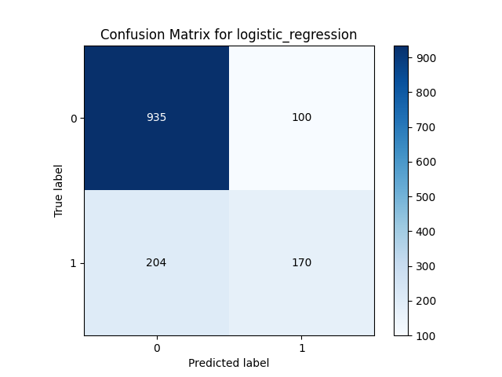
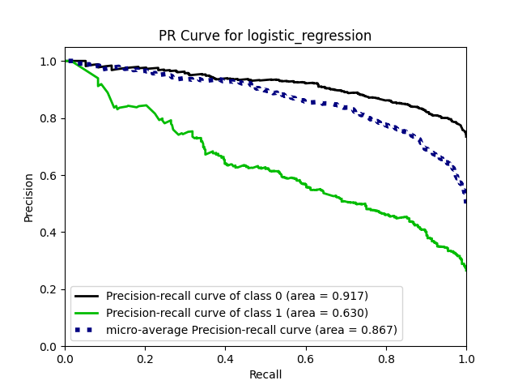
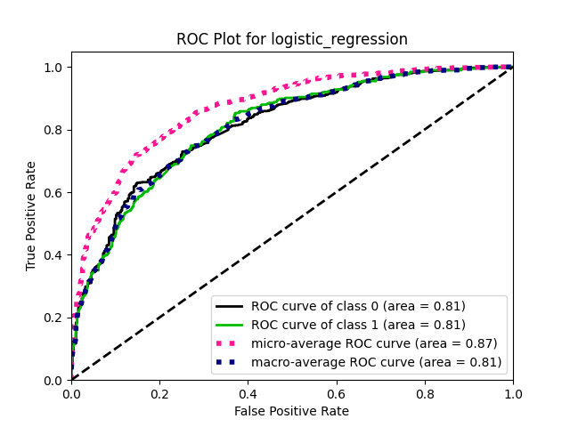

# Customized Classifier for Telco customer churn dataset

## Get started

1. Clone the repository:

    ```cmd
    git clone https://github.com/hassan-teymoury/python-ai-developer.git
    ```

2. Go to `app` directory:

    ```cmd
    cd app
    ```

3. Run `python_task_telco.py` code with specified arguments:

    ```cmd
    python3 python_task_telco.py --datapath=data/WA_Fn-UseC_-Telco-Customer-Churn.csv --topk_features=10 --test_size=0.2 --scaler_type=minmax_scaler --scale_axis=1 --classifier=sgd_classifier
    ```

## Code Architecture

This code has two main blocks (better to say __objects__):

1. Data Preprocessing Object

    Includes following operections to prepapre and preprocess data for training:
    
    1. Loading data from a .csv dataframe using __`--datapath`__ argument

    2. Converting the categorical features into numerical descrete space
    
    3. Feature selection to get best features for classifier training using __`--topk_features`__ 
    argument. Default value for this parameter is set to 7. I've used 
    __`mutual_info_classif`__ as a feature selection tool represented by __`scikit-learn`__. However, 
    we can use other approaches such as __correlation representation__ to get linear relationship 
    between features in our entire dataset 

    4. Scaling (normalizing) the data based on scaler type and scaler axis (that means scaling on 
    samples or features) using __`--scaler_type`__ and scaler_type __`--scale_axis`__ arguments.
       
        Available scaler types based on __sklearn package__: 

        __[default_scaler, minmax_scaler, robust_scaler, maxabs_scaler]__

        Set scale axis to __1__ for __feature based__ scaling and __0__ for __sample based__ scaling

    5. Splitting data into test and traing sets to get evaluation of the model on unseen data using 
     __`--test_size`__ argument. A value of 0.2 is recommended


2. Classifier Object:

    This object allows you to choose a classifier using __`--classifier`__ argument and Includes 
    following classifiers for train and test on dataset:

    1. __`xgb`__ or XGBoost classifier that use boosted decision trees for training. This algorithm 
     uses multiple classifiers in a sequence format in a way that could pass the results of previous   
    classifier to the next one in weight optimization process 

    2. __`logistic_regression`__ or Logistic Regression classifier that works based on a single neuron 
    learning with considering an activation function to get output and create gradients for 
    optimization process.

    3. __`sgd_classifier`__ or SGDClassifier that works similar to Logistic Regression. The main   
    difference is due to learning process. Here SGDClassifier uses a learning rate parameter to 
    optimize weights for learning.

    4. __`random_forest`__ or RandomForestClassifier that is similar to XGBoost classifier with 
    parallel processing on classifiers results for optimization. That means, here we have some 
    processors that could pass result of each classifier to another in a parallel format

    The classifier object in source code has two main parts:

    1. __Fitting (Training) selected classifier to training data__

    2. __Evaluation (Testing) selected classifier on test data that splitted before__

    As you run the __`python_task_telco.py`__ code with your desired arguments, at the first stage,
    data would be processed and then passed to __Classifier Object__. in Classifier object, at the 
    beginning, the selected algorithm would be fitted to training data and at the second step the 
    performance results would be visualized


## Evaluate the custom classifier on test data:

As run the `python_task_telco.py` with custom arguments, you can see the visualized evaluation metrics such as precision recall curve, ROC curve and Confusion matrix:


### __Confusion Matrix Example__



### __Precision-Recall Example__
  


### __Recall On Class Example__



## Compare performance results for different algorithms for a default setting

| Classifier | Accuracy    | Recall on class 1    | Recall on class 0    |
| :---:      | :---: | :---: | :---: |
| XGBoost Classifier    | 301   | 283   |20000 |
| Logistic Regression    | 301   | 283   |20000 |
| sd    | 301   | 283   |2000 |
| Seconds    | 301   | 283   |2000 |